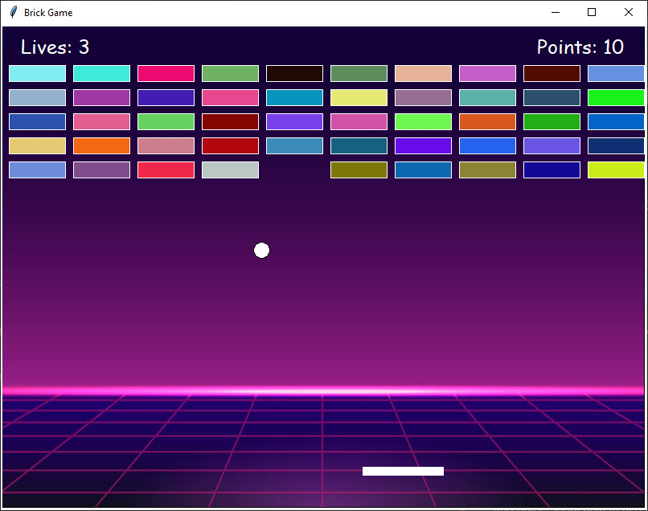

# Brick Breaker Game


## Table of Contents

- [About](#about)
- [Getting Started](#getting_started)
- [Usage](#usage)


## About <a name = "about"></a>

Brick Game, is a single player game. The plot of the game is that the player moves the paddle that acts as a base for the ball to bounce on and break the bricks. The player has to break all the bricks in order to win the game.

## Getting Started <a name = "getting_started"></a>

Clone the project and run the brick_breaker.py file.

### Prerequisites

You need to have python 3.10 installed on your system. You can download it from [here](https://www.python.org/downloads/).

```
python --version
```

### Installing

You'll need to install the following library in order to run the game.

```
pip install Pillow
```


## Usage <a name = "usage"></a>

this runs on all platforms as long as you have python installed.
